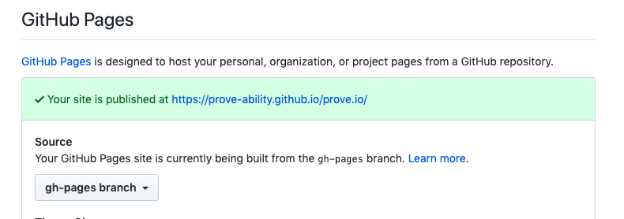

# github

## 1. 계정 생성 

> 기존에 사용하는 이메일을 입력하면 해당 이메일로 본인 확인 이메일이 발송

## 2. 저장소 추가

* Create a new repository
* 이때 저장소 이름 뒤에 .io 를 사용
* .gitignore(nodejs) 를 설정해주자
* gh-pages 브랜치 추가
* 설정에서 GitHub Pages.Source 부분을 master -> gh-pages 변경

## 3. git clone 으로 내려받기

```
git clone <SSH>
```

# vuepress

## 4. vuepress 설치

* vuepress 공홈에서는 npm 보다는 yarn 을 사용 권장(종속성 문제)

```shell
yarn init -y

# install as a local dependency
yarn add -D vuepress

# create a docs directory
mkdir docs

# create a markdown file
echo '# Hello VuePress' > docs/README.md
```

## 5. package.json 내용 추가

```js
...
{
  "scripts": {
    "docs:dev": "vuepress dev docs",
    "docs:build": "vuepress build docs"
  }
}
```

## 6. 디렉터리 구조 생성

```
.
├── docs
│   ├── .vuepress (Optional)
│   │   ├── components (Optional)
│   │   ├── theme (Optional)
│   │   │   └── Layout.vue
│   │   ├── public (Optional)
│   │   ├── styles (Optional)
│   │   │   ├── index.styl
│   │   │   └── palette.styl
│   │   ├── templates (Optional, Danger Zone)
│   │   │   ├── dev.html
│   │   │   └── ssr.html
│   │   ├── config.js (Optional)
│   │   └── enhanceApp.js (Optional)
│   │ 
│   ├── README.md
│   ├── guide
│   │   └── README.md
│   └── config.md
│ 
└── package.json
```

## 7. 라우팅

* docs 디렉터리의 상대 경로를 기준으로 라우팅이 자동으로 생성

상대 경로 | 페이지 라우팅
--- | ---
/README.md | /
/guide/README.md	 | /guide/
/config.md | /config.html

## 8. 설정 파일 생성

* 구성이 없으면 페이지는 매우 적으며 사용자는 사이트를 탐색 할 방법이 없습니다.

```js{5}
.
├─ docs
│  ├─ README.md
│  └─ .vuepress
│     └─ config.js <-
└─ package.json

--------------------------------------------

module.exports = {
  title: 'Hello VuePress',
  description: 'Just playing around'
}
```

## 8. 설정 파일에 base 추가

* 배포 후 정적 파일을 불러오는 부분 경로 설정
* themeConfig - 테마 설정을 위해 추가

```js{4}
module.exports = {
	title: 'prove dev',
	description: 'Just playing around2',
	base: '/prove.io/',
	themeConfig: {
		smoothScroll: true,
		logo: './logo.png',
		sidebar: [
			{
				title: 'about prove', // required
				path: '/about/', // optional, which should be a absolute path.
				collapsable: false, // optional, defaults to true
				sidebarDepth: 1 // optional, defaults to 1
			}
		]
	}
};

```

## 9. .travis.yml 추가

> $GITHUB_TOKEN <- github 에서 공개키 생성 이때 repo 권한 추가
<br>
> 발급받은 공개키를 travis-cli 툴로 암호화하여 deploy.token.secure 에 추가

```yml{14}
language: node_js
os: linux
node_js:
- lts/*
install:
- yarn install
script:
- yarn docs:build
deploy:
  provider: pages
  edge: true
  local_dir: docs/.vuepress/dist/
  token:
    secure: $GITHUB_TOKEN
  keep_history: true
  on:
    branch: master
```

## 10. travis 연동

* travis 홈페이지 접속
[travis](https://travis-ci.com/ "travis homepage")
<br>
* 로그인은 github 계정으로 진행
<br>
* github 저장소 연동

## 11. 배포

```shell
git add .

git commit -m 'first commit'

git push
```

## 12. travis 확인

* 연동된 저장소의 빌드 내역을 확인할 수 있다 - job log, view config

## 13. 배포된 사이트 확인



#### repo - settings - GitHub Pages 에 차례로 들어가면 배포된 주소 확인

## [PROVE](https://prove-ability.github.io/prove.io/) 클릭하면 글쓴이가 배포한 사이트 확인

---
### 본 문서는 아래 문서를 참조하여 작성했습니다.
### [vuepress doc](https://v1.vuepress.vuejs.org/guide/ "vuepress link")
### [travis-ci doc](https://docs.travis-ci.com/user/deployment/pages/ "travis link")